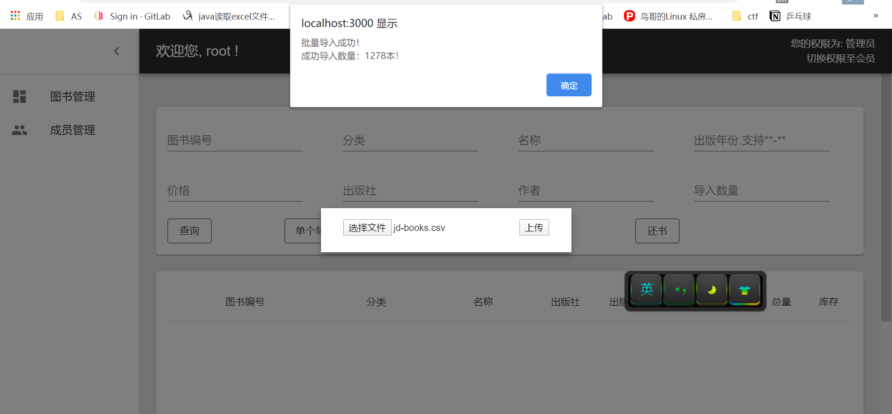

### 数据库程序设计——图书管理系统

#### 一、实验目的

1. 设计并实现一个精简的图书管理系统，具有入库、查询、借书、还书、借书 证管理等基本功能。 
2. 通过本次设计来加深对数据库的了解和使用，同时提高自身的系统编程能力。

#### 二、实验平台

1. 前端开发工具：React
2. 后端开发工具：python3.7 flask
3. 数据库平台：MYSQL

#### 三、部分设计

- **数据库 table设计**

  - 用户表 users
    user(<u>name</u>, password, kind)
  
  - 借书表 borrow
  
      borrow(<u>name</u>, <u>bno</u>, <u>borrow_time</u>, return_time）
  
  - 书籍表 book

    book(<u>bno</u>, category, title, press, year, author, price, total, stock)

- **采用MySQL+python(flask框架）+react来完成本系统。**

#### 四、界面设计

1. 登录界面

   

   登录页面需要用户输入用户名 与对应密码，后端验证密码与用户名匹配，则显示对应权限的界面，如果结果不匹配，则会给出提示。

   

   

2. 主界面

   采用左侧可伸缩导航栏的布局，主界面上方显示欢迎提示，右侧给出当前权限

   管理员权限

   

   会员权限，注意右上角权限不同

   

3. 图书查询模块

   - 根据编号精确查询

     

   - 根据分类等进行模糊查询

     

   - 根据出版年份进行区间查询

     

     

4. 借书模块

   点击借书按钮后会弹出Modal，填写后提交即可借书，借书成功会有提示，并且该书库存-1

   

   如果不输入编号，则会进行提示

   

   输入编号不存在，会给出提示

   

   库存为0，会给出提示

   

   

5. 还书模块，与借书模块类似

   没有借书，则会给出提示

   

   

6. 导入模块

   - 单个导入，允许除主键以外的值为空，导入数量必须填写，否则会给出提示

     

   - 批量导入(已删除 自行添加.jpg)

     

     

7. 成员管理模块

   进入管理员权限后，左侧会出现成员管理导航栏，进入后可以对成员进行添加，删除，对管理员进行添加

   

   

   添加后：

   

   
